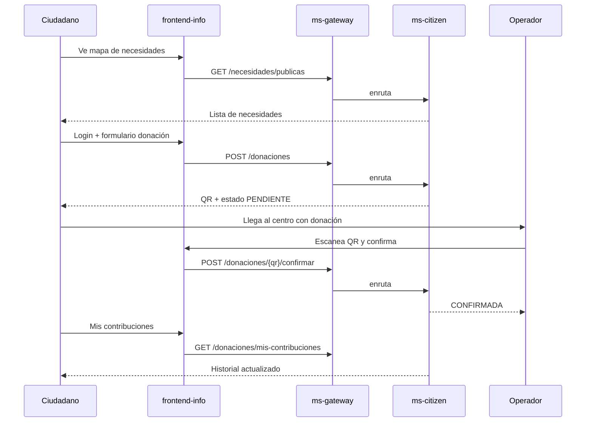

# Cómo lo usa una persona — ms-citizen

El ciudadano **no entra** a `localhost:8084`. Usa el portal **frontend-info**, que habla con el **API Gateway** (`:8080`), y este reenvía a ms-citizen.

```
Usuario → frontend-info → ms-gateway (:8080) → ms-citizen (:8084)
```

---

## Tipos de usuario

| Quién | Qué hace en la práctica |
|-------|-------------------------|
| **Ciudadano** | Ve qué falta, elige centro, dona, revisa su historial |
| **Operador de centro** | Escanea el QR y confirma que llegó la donación |
| **Autoridad / admin** | Registra necesidades manualmente cuando hace falta |

---

## Flujo 1 — Ciudadano que quiere ayudar

### Paso 1: Ver qué se necesita (sin login)

En el mapa o listado del portal se muestran necesidades activas.

- API: `GET /necesidades/publicas`
- Ejemplo: “Centro X necesita 50 frazadas, prioridad ALTA”

También puede filtrar por centro:

- API: `GET /necesidades/centro/{centroId}`

### Paso 2: Elegir centro e ítems (wizard de donación)

1. Elige un **centro de acopio** (datos de ms-resources / ms-emergencies).
2. Ve las **necesidades** de ese centro.
3. Indica qué lleva: ítems y cantidades (agua, colchones, etc.).

### Paso 3: Registrarse y confirmar la donación (con login)

Debe iniciar sesión (Firebase). Al enviar el formulario:

- API: `POST /donaciones`
- Permiso: `DONACION_REALIZAR`

El sistema:

1. Guarda la donación como **PENDIENTE**.
2. Genera un **código QR** único.
3. Publica el evento `donation.created` (otros servicios pueden enterarse).

El ciudadano ve el QR en pantalla (o lo lleva impreso) para entregarlo en el centro.

### Paso 4: Ver su impacto

En “Mis contribuciones”:

- API: `GET /donaciones/mis-contribuciones`

Ve historial: qué donó, a qué centro, estado (pendiente / confirmada).

---

## Flujo 2 — Operador en el centro de acopio

Cuando alguien llega con donación:

1. Escanea el **QR** del donante (o ingresa el código).
2. Confirma recepción en la app (dashboard o app de operador).

- API: `POST /donaciones/{codigoQr}/confirmar`
- Permiso: `DONACION_CONFIRMAR`

El sistema:

1. Pasa la donación a **CONFIRMADA**.
2. Publica `donation.confirmed`.
3. Registra quién confirmó y cuándo.

El donante, al revisar “Mis contribuciones”, ve el cambio de estado.

---

## Flujo 3 — Necesidades automáticas (sin que el usuario haga nada)

Cuando el inventario de un centro baja mucho (ms-resources):

1. Se publica `stock.critical` en RabbitMQ.
2. **ms-citizen** crea sola una necesidad (origen **AUTOMATICO**).
3. Esa necesidad aparece en `/necesidades/publicas`.

El ciudadano solo ve “ahora falta X en el centro Y”; no interactúa con RabbitMQ.

---

## Flujo 4 — Autoridad que registra una necesidad manual

Si una autoridad detecta un faltante que el sistema no cubrió:

- API: `POST /necesidades`
- Permiso: `NECESIDAD_GESTIONAR`

Se publica `need.created` y la necesidad queda visible para donantes.

---

## Diagrama resumido



---

## Qué ve vs qué no ve el usuario

| Ve | No ve |
|----|--------|
| Necesidades por centro y prioridad | PostgreSQL, Flyway, RabbitMQ |
| Formulario de donación y QR | Puerto 8084 directo |
| Historial de sus donaciones | Eventos `need.created`, etc. |
| Confirmación en el centro | Otros microservicios (salvo lo que el frontend muestre) |

---

## Referencia rápida de APIs

| Método | Ruta | Auth | Permiso | Uso |
|--------|------|------|---------|-----|
| `GET` | `/necesidades/publicas` | No | — | Mapa / listado público |
| `GET` | `/necesidades/centro/{centroId}` | No | — | Wizard paso 2 |
| `POST` | `/necesidades` | Sí | `NECESIDAD_GESTIONAR` | Alta manual |
| `POST` | `/donaciones` | Sí | `DONACION_REALIZAR` | Registrar donación + QR |
| `POST` | `/donaciones/{codigoQr}/confirmar` | Sí | `DONACION_CONFIRMAR` | Operador confirma recepción |
| `GET` | `/donaciones/mis-contribuciones` | Sí | Usuario autenticado | Panel de impacto |

---

## Estado actual del proyecto

- **Backend (ms-citizen):** APIs listas.
- **frontend-info:** servicios/hooks preparados (`usePublicNeeds`, `useDonations`, etc.).
- **UI del wizard** (formulario, mapa, panel de impacto): aún por conectar del todo en pantallas.

En resumen: ms-citizen es el **motor de necesidades y donaciones**; el ciudadano lo usa a través del portal web para **ver qué falta, donar con QR y seguir su aporte**, y el operador para **confirmar que la donación llegó**.
